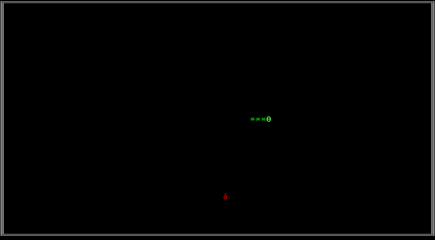

# Boot sector snake game
My first boot sector game. A textmode snake game, that fits into the boot sector (512 Byte) of any data storage device. Should be compatible with Intel 80186 instruction set.



## Build
#### Prerequisites
```
# Debian
sudo apt-get install nasm # Assembler
sudo apt-get install qemu # Or bochs or whatever
```

#### Build binary and floppy image
```
# Auto
./build.sh

# Or manual
# Create bin and img folders
mkdir -p bin
mkdir -p img

# Build binary. Can be written to any device image
nasm src/main.asm -i src/ -o bin/main.bin

# Build 3 1⁄2-inch 1,4MB floppy image
nasm src/main.asm -i src/ -o img/bootSectorSnake.img -dIMAGE

```

#### Interesting resources
* https://github.com/nanochess/fbird
* https://nanochess.org/
* https://www.youtube.com/watch?v=mYPzJlqQ3XI
